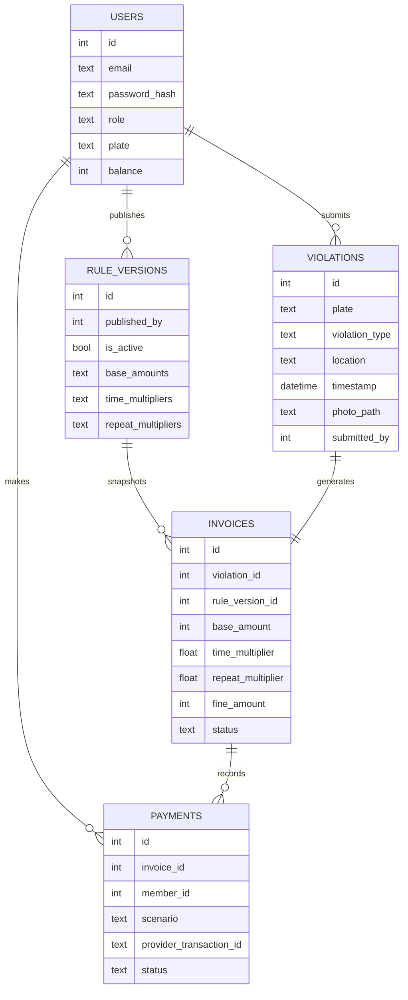

# Design

This portal is a local-only demo built around a single Go process and a single SQLite file. The backend owns authentication, rule publication, violation ingestion, invoice generation, payment state, and member profile updates. The Next.js frontend is a separate client that talks to the backend over HTTP and stores the JWT locally for route guards.

## Data Model

The important boundary is the invoice row. It stores the rule version and the calculated amounts at creation time, so later rule changes never rewrite old fines.

## Request Flow

1. The officer logs in and receives a signed JWT containing `sub`, `role`, and `exp`.
2. Auth middleware validates the token and injects the user identity into the request context.
3. Rule publication creates a new active rule version and deactivates the previous one.
4. A violation submission writes the photo, reads the active rule, calculates the fine, and inserts a violation plus a frozen invoice snapshot.
5. Payment attempts deduct balance first, then simulate the provider response. Success marks the invoice paid; failure refunds the balance and marks the invoice failed.

## Immutability

Rule changes are versioned rather than edited in place. The application reads the active rule for new violations, but existing invoices keep their own `rule_version_id`, base amount, multipliers, and final fine. That keeps historical charges auditable and prevents retroactive price changes.

## Trade-offs

- Uploaded photos are written before the database transaction completes, so a DB failure can leave an orphaned file in `uploads/`.
- JWTs are stateless and there is no refresh-token flow, which keeps the demo simple but makes token revocation coarse-grained.
- SQLite is enough for this assignment, but concurrent write throughput is limited compared with a server database.
- Payment processing is intentionally mocked; the goal is to exercise state transitions and rollback paths, not integrate a real PSP.